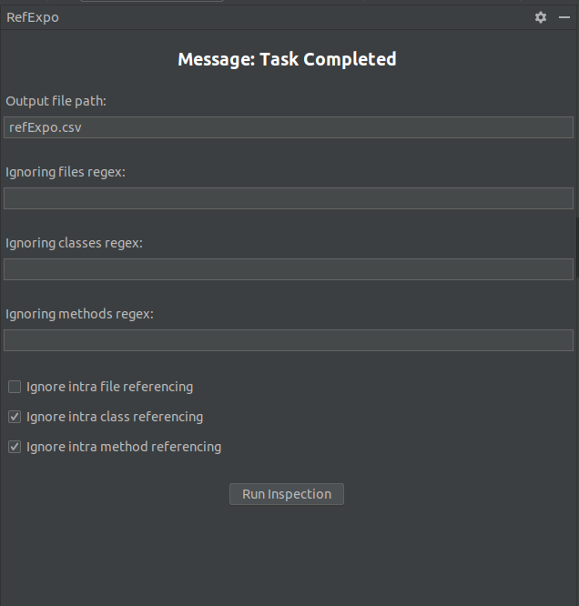

# RefExpo

RefExpo is an IntelliJ plugin that constructs a dependency graph of a project. It supports all languages that IntelliJ supports.



## Features

- Constructs a dependency graph of a project
- Provides a simple filtering API to filter unwanted references

## Installation

To install the RefExpo plugin, follow these steps:

1. Open IntelliJ IDEA.
2. Go to `File > Settings > Plugins`.
3. Click on `Marketplace`.
4. Search for `RefExpo`.
5. Click on `Install`.

## Sandbox

You can start an instance of IDE by running 
```
    ./gradlew runIde
```

It will run the selected IDE with RefExpo installed.
You can modify the IDE instance and its version, pluse the installed plugins after starting from [gradle.properties](gradle.properties) file.
For more information look into (official JetBrains documentation)[https://plugins.jetbrains.com/docs/intellij] and (plugin template repository)[https://github.com/JetBrains/intellij-platform-plugin-template]

## Usage

After installing the plugin, you can use it to construct a dependency graph of your project. The plugin provides a simple filtering API that you can use to filter out unwanted references.

## Contributing

Contributions are welcome! Please read our contributing guidelines to get started.

## License

This project is licensed under the terms of the MIT license.