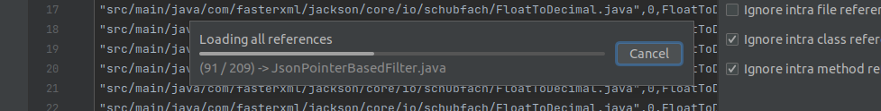

# RefExpo

RefExpo is an IntelliJ plugin that constructs a dependency graph of a project. It supports all languages that IntelliJ supports.

## Why RefExpo

Assessing the dependency graph of a software project can provide valuable information that could be leveraged to enrich and increase the accuracy of other calculations. 
It can also be a field of study on how to extract this graph and what information you can draw directly from this graph. 
There are numerous studies utilizing this information to find the key components as the main study or as a metric incorporated in their secondary calculation. 
Despite the number of these studies, the field lacks a sophisticated and detailed tool to extract this information for big projects. 
The majority of software papers evaluating dependency graphs do not share their dataset or tool. 
Existing tools at the moment are either hard to use and not compatible with current version of technologies or do not provide accurate results. 

## Features

- Constructs a dependency graph of a project
- Provides a simple filtering API to filter unwanted references

## Installation

### Market Place

To install the RefExpo plugin you can go directly to [RefExpo page](https://plugins.jetbrains.com/plugin/23684-refexpo), or follow these steps:

1. Open IntelliJ IDEA.
2. Go to `File > Settings > Plugins`.
3. Click on `Marketplace`.
4. Search for `RefExpo`.
5. Click on `Install`.

### Manual Installation

For manual installation you can refer to the [Releases section](https://github.com/vharatian/RefExpo/releases) of this repository to obtain the latest build. Afterward follow install from disk [guide](https://www.jetbrains.com/help/idea/managing-plugins.html#install_plugin_from_disk).

## Development

You can start an instance of selected IDE by running the following command.
```
    ./gradlew runIde
```

It will download the specified IDE with its version and run with RefExpo installed.

You can modify the IDE instance and its version, pluse the installed plugins after starting from [gradle.properties](gradle.properties) file.
For more information look into (official JetBrains documentation)[https://plugins.jetbrains.com/docs/intellij] and (plugin template repository)[https://github.com/JetBrains/intellij-platform-plugin-template]

## Usage

After installation RefExpo will be added as a Tool Window to the right edge of the IDE and titled as "RefExpo". Here is a sample screenshot of the windows.


By pressing "Run Inspection" button it will start the process and provide live report in a modal progress bar, which will limit the user interaction with IDE during the evaluation. Here is an screenshot of the modal.



### Filters

Since generated output for a medium sized project can simply goes beyond 10 MB and over 10GB for large projects it is better to filter out the unwanted graph edges from the beginning.
 It can significantly reduce the size of generated output.

#### Circular References

One of the main sources for having a huge output is including circular references since. 
It is so common for a component such a method to reference itself more than referencing other components. 
You can simply filter out these references by checking the corresponding checkbox.

-Ignore Intra file referencing.
-Ignore Intra class referencing.
-Ignore Intra method referencing.

#### Regex Filtering

You can ignore unwanted entities in different levels by specifying a filtering regex.
For advanced filtering you might want modify the `ignored` method specified in `RefExpoEvaluation`.

- **Ignore unwanted files.**
    You can ignore the unwanted files, for instance you can enter `*.html` which will result in removal of all edges to or from html files and all containing elements. you can also ignore all files existing in a certain path.

- **Ignore unwanted  classes.**
    You can ignore the unwanted classes. A regex such as `*Impl` will result in removal of all edges to or from classes that their name finishes with Impl.

- **Ignore unwanted methods.**
    You can ignore the unwanted methods. This is a useful feature to remove method such as getters. `get*` will result in removal of all getter methods from the graph.

Be careful that the regex ignoring might result in unwanted removal of other desired edges as well. 
For instance all methods that start with `set` are not simple setters and might have a large body with business logic.

### Output
After evaluations RefExpo will generate a file in csv format in the path specified in the `Output File Path` field. 
The resulting graph is specified in format of edge list. 
Therefore each line fo csv file specify an edge in format of `source` and `target`.
The output file provides information for two component locator one for `source` one for `target`.
The following list the parameters for each locator. The locator parameters will be prefix with `source` or `target` to mark its correspondence to one of the edge poles.

- *Path.* Containing file path.
- *Line.* Exact line number in the containing file.
- *Class.* Containing class name without package name.
- *ClassFull.* Specify the full class name, including package name, `.` separated.
- *Method.* Containing method name without class or package name.
- *MethodFull.* Specify the full method name , including package and class name `.` separated by.
- *Structure.* Specify the structure of the component within the file. This filed comes handy when there are nested class or methods. It will specify the parent classes and methods in the file.

## Contributing

Contributions are welcome!

## License

This project is licensed under the terms of the MIT license.